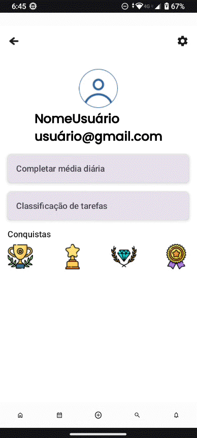

# Profile Screen Test

### _Um modelo de `Tela de Perfil` Simples para o `Android`_

## 👀Funções Principais (Visualização)

1. Botões `Voltar`, `Configurações`;
2. Trocar de `Imagem de Perfil`;
3. Colocar seu `Nome` e seu `E-mail`;
4. Mostrar `Média diária` e `Classificação de tarefas`;
5. Mostrar `Conquistas`;
6. Footer com Botões `Home`, `Calendário`, `Adicionar tarefa`, `Pesquisa` e `Notificações`.

## 👨‍💻 Como foi Feito?

- **_Feito em [Kotlin](https://kotlinlang.org/)_** 📲  
- **_Usando [Jetpack Compose](https://developer.android.com/jetpack?gad_source=1&gclid=CLvL07Omo4oDFX5BSAAdNE0ITA&gclsrc=ds&hl=pt-br)_** 🤖
- **_E o [Gradle](https://gradle.org/)_** 🐘

## 📂Pastas Principais

| Pasta/Arquivo      | Descrição                                                                                                                                                        |
| ------------------ | ---------------------------------------------------------------------------------------------------------------------------------------------------------------- |
| `Gradle`           | É uma `Ferramenta` de automação de construção de software para o `Android`. Ajuda na `Construção`, `Teste` e `Implementação de Apps`.                            |
| `App`              | Foi Separado nestes dois Programas em Kotlin abaixo:                                                                                                             |
| `MainActivity.kt`  | Configura a `Interface de Usuário` usando `Jetpack Compose` com insets da janela.                                                                                |
| `ProfileScreen.kt` | Define a tela de perfil do usuário com várias Seções como `Barra Superior`, `Informações do Usuário`, `Média Diária`, `Classificação de Tarefas` e `Conquistas.` |
